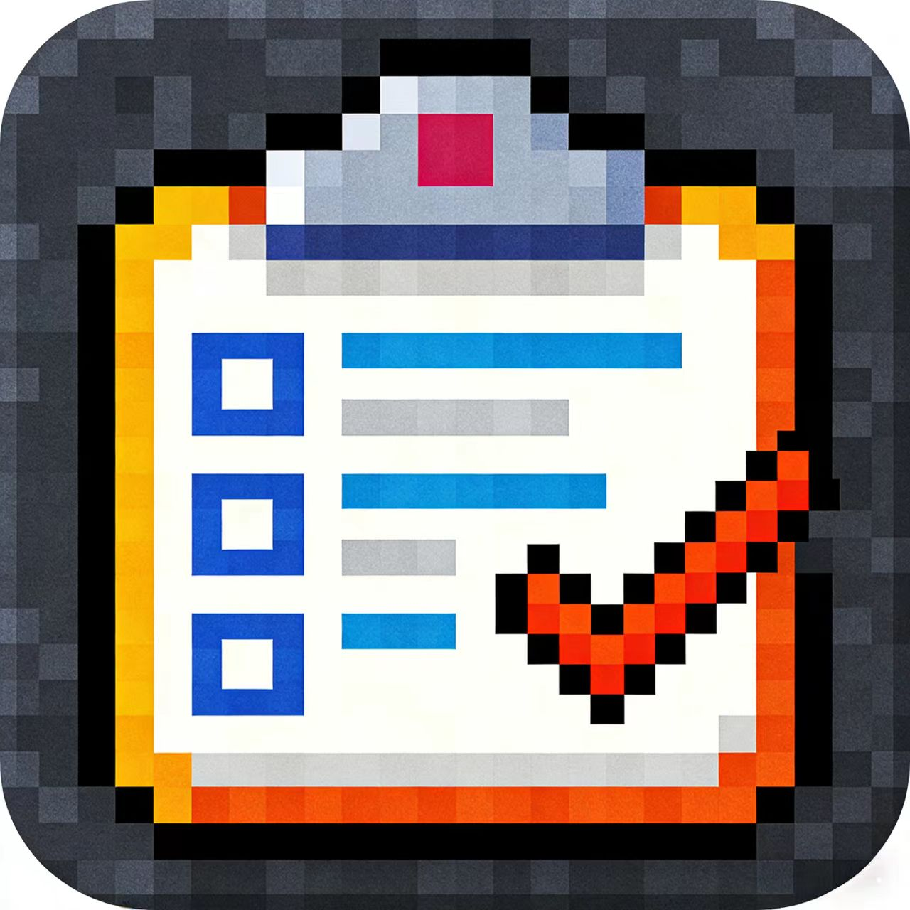

# LiTasker

LiTasker is a Flutter task manager with a bold neo-brutalism UI style.  
LiTasker 是一个使用 Flutter 构建的任务管理应用，采用 neo-brutalism 视觉风格。

It stores data locally with Hive and supports list view, calendar view, and JSON backup import/export.  
应用通过 Hive 进行本地数据存储，支持列表视图、日历视图以及 JSON 备份导入导出。

## Features

- Local-first task storage using Hive.
- Smart views: Inbox, Today, and Next 7 Days.
- Custom task lists with icon and color.
- Task priority and completion status management.
- Calendar mode (month/week/day switch in UI).
- Quick add task flow.
- JSON backup export/import via file picker.

## 功能特性（中文）

- 使用 Hive 本地持久化任务数据。
- 智能视图：Inbox、Today、Next 7 Days。
- 支持自定义任务列表（图标与颜色）。
- 支持任务优先级与完成状态管理。
- 提供日历模式（月/周/日切换）。
- 提供快速新增任务流程。
- 支持通过文件选择器导出/导入 JSON 备份。

## Tech Stack

- Flutter (Material 3)
- Dart
- Hive / hive_flutter
- file_picker
- flutter_markdown

## Project Structure

```text
lib/
  main.dart
  enums.dart
  models/
    task.dart
    task_list.dart
  screens/
    neo_home_page.dart
  utils/
    neo_brutalism.dart
    priority_color.dart
```

## Screenshots & Demo

> You can replace these with real app screenshots later.
> 你可以后续替换为真实应用截图。



### Quick Demo Flow

1. Launch app and wait for splash.
2. Use `+` button to create a task.
3. Switch between list and calendar mode.
4. Export data to JSON from sidebar.
5. Import backup JSON to restore data.

### 使用演示（中文）

1. 启动应用并等待启动页完成。
2. 点击 `+` 新增任务。
3. 在列表视图与日历视图间切换。
4. 通过侧边栏导出 JSON 备份。
5. 通过导入恢复备份数据。

## Getting Started

### 1. Prerequisites

- Flutter SDK installed
- A supported IDE (VS Code / Android Studio)
- Device emulator or physical device

### 2. Install dependencies

```bash
flutter pub get
```

### 3. Run the app

```bash
flutter run
```

## Data Storage

- Hive box `tasks`: stores all task records.
- Hive box `taskLists`: stores custom list metadata.

Data stays on-device unless you manually export/import a backup JSON file.

## Build Notes

- App icon generation is configured through `flutter_launcher_icons` in `pubspec.yaml`.
- If model classes change, regenerate Hive adapters:

```bash
flutter pub run build_runner build --delete-conflicting-outputs
```

## Current Repository Status

This repository currently includes ongoing UI refactor changes (legacy files removed and `neo_home_page.dart` introduced).  
If `flutter analyze` reports syntax errors, complete the pending refactor before preparing a production release.

## License

No license file is included yet. Add one before public distribution if needed.

未包含 License 文件，若要公开分发请补充许可证。
