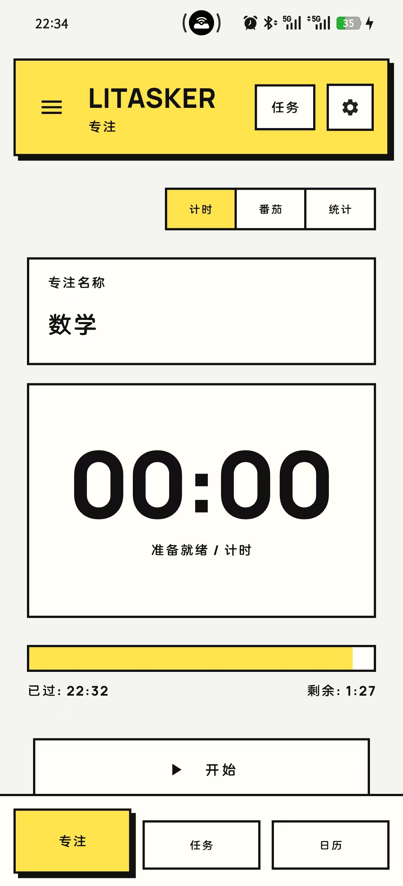
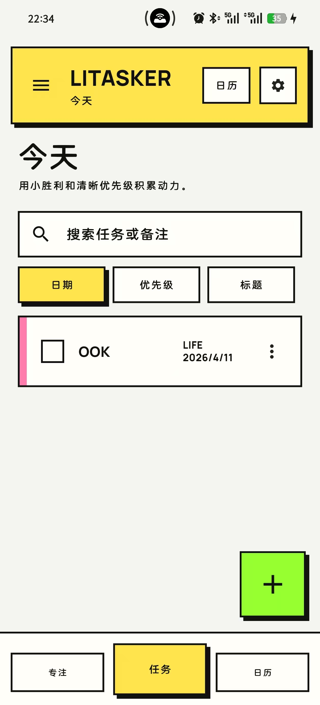
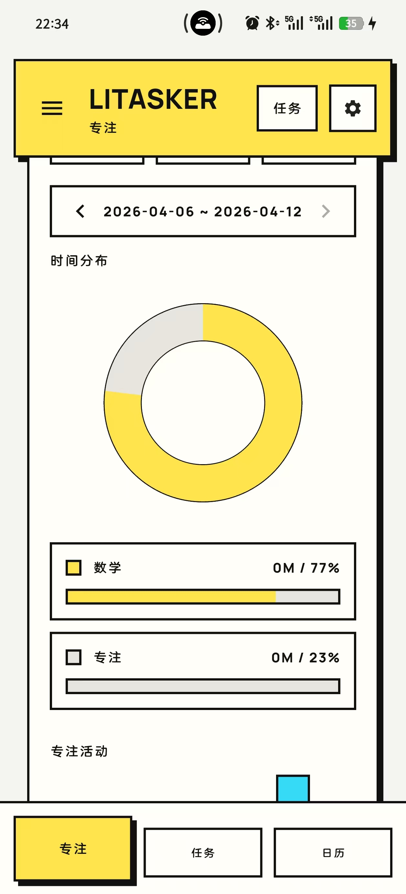
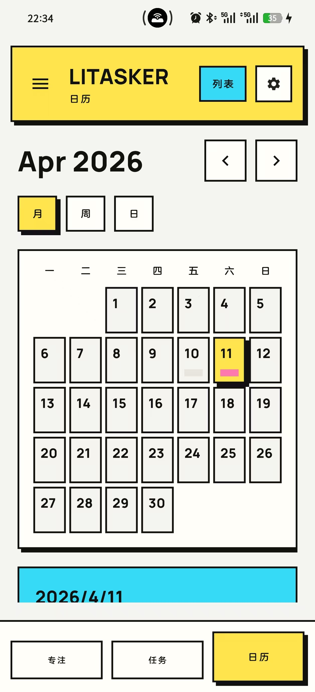

# LiTasker

LiTasker 是一个本地优先的 Flutter 任务与专注管理应用。它把任务清单、日历规划、番茄/计时专注、学习统计和 JSON 备份放在同一个轻量应用里，视觉上保留了偏 neo-brutalism 的硬朗风格。

<p align="center">
  
</p>

## 截图

<p align="center">
  
  
  
  
</p>

图片大小通过 `width` 控制，比如 `width="260"`。手机竖屏截图建议用 `220` 到 `300`，横向截图建议用 `720` 到 `900`。如果想让截图更大，把上面的 `260` 改成 `300`；如果一行放不下，就改成 `220`。

## 亮点

- 本地优先：任务、清单、设置和专注统计保存在本机，不依赖服务端。
- 专注首页：打开应用默认进入 Focus，可以在普通计时和番茄模式之间切换。
- 学习统计：支持按日、周、月查看专注数据，并按科目筛选统计。
- 任务管理：支持收件箱、今天、未来 7 天、已完成、自定义清单、优先级和备注。
- 日历视图：支持月、周、日视图，方便按日期查看和安排任务。
- 快速添加：支持优先级、日期、清单选择，并可批量生成每日/每周重复任务。
- 搜索与排序：任务页支持搜索标题/备注，并按日期、优先级或标题排序。
- 数据备份：支持 JSON 导入导出，并在导入时做基础格式校验。
- 设置中心：可调整专注时长、休息时长、今日目标、默认首页、备份提醒和减少动效。

## 功能概览

| 模块 | 说明 |
| --- | --- |
| Focus | 计时、番茄、开始/结束专注、当前科目、今日进度条 |
| Stats | 总专注时长、今日目标、连续天数、平均时长、科目分布、趋势图 |
| Tasks | 智能视图、自定义清单、搜索、排序、快速添加、完成/删除/移动任务 |
| Calendar | 月/周/日视图，按日期查看任务 |
| Settings | 专注参数、任务默认行为、备份提醒、导入导出、清空本地数据 |

## 技术栈

- Flutter / Dart
- Hive / hive_flutter
- file_picker
- flutter_markdown
- shared_preferences
- flutter_launcher_icons

## 项目结构

```text
lib/
  main.dart
  enums.dart
  models/
    task.dart
    task.g.dart
    task_list.dart
    task_list.g.dart
  screens/
    neo_home_page.dart
    neo_home_page_calendar.dart
    neo_home_page_detail.dart
    neo_home_page_misc.dart
    neo_home_page_widgets.dart
  utils/
    neo_brutalism.dart
    priority_color.dart
```

## 本地运行

安装依赖：

```bash
flutter pub get
```

运行应用：

```bash
flutter run
```

运行分析和测试：

```bash
flutter analyze
flutter test
```

生成 debug APK：

```bash
flutter build apk --debug
```

生成位置：

```text
build/app/outputs/flutter-apk/app-debug.apk
```

## 数据说明

LiTasker 当前不需要后端服务，核心数据会保存在本机：

- `tasks`：任务数据
- `taskLists`：清单数据
- `settings`：设置、专注统计、备份状态等

如果要迁移数据，可以在设置页导出 JSON 备份，再在另一台设备上导入。

## 开发说明

如果修改了 Hive model 字段，需要重新生成 adapter：

```bash
flutter pub run build_runner build --delete-conflicting-outputs
```

如果修改了应用图标配置，可以重新生成 launcher icons：

```bash
flutter pub run flutter_launcher_icons
```

## Roadmap

- 加强重复任务：从“批量生成”升级为真正的重复规则。
- 加提醒通知：为任务和专注结束加入本地通知。
- 优化备份体验：导入前预览、冲突处理、自动备份提醒。
- 补充截图/GIF：让 GitHub 首页更直观看到实际界面。
- 完善测试：增加任务搜索、排序、专注计时和导入导出的覆盖。

## License

当前仓库还没有添加 License。正式公开分发前，建议补充一个明确的开源协议。
